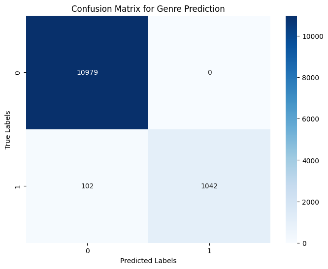

# Genre Classification using NLP
## Dataset
https://www.kaggle.com/datasets/ramjasmaurya/top-250s-in-imdb

This dataset includes files with the top 1000 Movies and TV Series and the top 250 video games according to IMDB's rankings. 

Files used in this project are:
- imdb (1000 movies) in june 2022.csv
- imdb (1000 tv series) - (june 2022).csv
- imdb(VIDEO GAMES).csv

## genre_classification.ipynb

This Jupyter notebook uses NLP techniques and a simple neural network to predict the genres of a movie, tv series, or video game based on the content summary. Summaries are vecctorized using TFIDF vectorizer and the neural network is implemented using PyTorch. 

## Results

- Precision: 0.9916
- Recall:   0.9916
- Accuracy: 0.9916
- F1 Score: 0.9916

